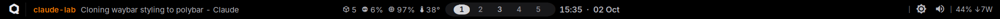

# polybar for Qubes OS dom0 (hyprliquid look)



*Preview rendered in a test session. Your tray shows the Qubes widgets and qube applets in the empty space on the right.*

This is a port of the waybar from my Arch + Hyprland rice ([hyprliquid-dotfiles](https://github.com/1mirax/hyprliquid-dotfiles), `dots/.config/waybar`) to **polybar in dom0**, on Qubes OS 4.3 with **i3**. It is one flat, opaque black strip, 38 px tall. It was tuned on a ThinkPad X390 at 1920x1080, scale 1.

Rules this project follows: security first, then lightweight, and everything explained.

## Layout

| Left | Centre | Right |
| --- | --- | --- |
| Qubes logo (opens the Qubes app menu) · focused window: **qube name in its label colour** + title | qubes running · CPU · RAM · temperature · **workspace pill 1-5** · clock | tray · brightness · volume · battery `44% ↓7W` |

Left out on purpose:

- **Network and Bluetooth modules.** dom0 has no network. They live in sys-net / sys-usb, and their applets appear in the tray, tinted in the qube's colour. Reading their state from dom0 would add attack surface just for an icon.
- **Idle inhibitor.** The screen lock is a security boundary.
- **Tooltips and hover effects.** polybar has neither.

## Files

```
dom0/build-polybar-dom0.sh    run in a qube with network: builds the bundle (source of truth)
dom0/update-polybar-dom0.sh   run in dom0: updates config + scripts of an installed bar
template/install-tray-bg.sh   run as root in a template: dark tray icon background
docs/polybar.md               this file
```

What ends up in dom0:

```
~/.config/polybar/config.ini                main config
~/.config/polybar/launch.sh                 picks the backlight device, (re)starts polybar; i3 runs it via exec_always
~/.config/polybar/scripts/qube-window.sh    focused window: qube name + colour, sanitised title
~/.config/polybar/scripts/qubes-stats.sh    qubes / CPU / RAM / temp from one long-running xentop
~/.config/polybar/scripts/workspaces.py     i3 workspace pill over i3 IPC (Python stdlib only)
~/.config/polybar/scripts/battery.sh        battery text
~/.local/share/fonts/qubes-polybar/         Inter Tab (Regular, SemiBold), Symbols Nerd Font
```

The log is at `$XDG_RUNTIME_DIR/polybar.log`.

## Install

dom0 has no network, so the bundle is built in a qube and copied into dom0.

**1. Build, in a qube with network** (Fedora or Debian based; a disposable or `personal`):

```bash
sha256sum build-polybar-dom0.sh      # compare with the hash at the end of this file
less build-polybar-dom0.sh
bash build-polybar-dom0.sh
```

It installs Inter and fontTools from the distro's signed repository (in an app qube these are gone after a restart). It downloads Symbols Nerd Font **v3.5.1, pinned to one SHA-256**, and rejects any other file. Then it makes "Inter Tab", writes the config and scripts, packs `~/qubes-polybar.tar.gz`, and prints the exact dom0 command for the next step.

**2. Copy into dom0, check, then install:**

```bash
qvm-run --pass-io <qube> 'cat /home/user/qubes-polybar.tar.gz' > ~/qubes-polybar.tar.gz
tar -tzvf ~/qubes-polybar.tar.gz            # only ./fonts/... and ./polybar/..., no "../", no leading "/"
mkdir ~/qubes-polybar
tar -xzf ~/qubes-polybar.tar.gz -C ~/qubes-polybar --no-same-owner
less ~/qubes-polybar/install-dom0.sh ~/qubes-polybar/polybar/scripts/*

sudo qubes-dom0-update polybar xprop brightnessctl
~/qubes-polybar/install-dom0.sh
```

Read the scripts **in dom0**. If the build qube were compromised, it could show you a clean file there and still send a changed one. What you read in dom0 is what actually runs.

`install-dom0.sh` installs the fonts and the config, keeping backups. It edits the i3 config i3 actually reads (`~/.i3/config` if that exists, otherwise `~/.config/i3/config`, copied from `/etc/i3/config` when missing). It comments out i3's `bar { }` block with a `# [polybar]` prefix, adds `exec_always --no-startup-id ~/.config/polybar/launch.sh`, and shows the diff. Then reload i3 with **Mod+Shift+r**.

**3. Brightness keys.** Under Xfce its power manager handled F5/F6; i3 doesn't. Add this to `~/.config/i3/config`:

```
bindsym XF86MonBrightnessUp   exec --no-startup-id brightnessctl -q set 5%+
bindsym XF86MonBrightnessDown exec --no-startup-id brightnessctl -q --min-value set 5%-
```

`--min-value` stops at the lowest step instead of 0, so the screen can't go fully black. `brightnessctl` works without root through systemd-logind.

**4. picom.** If picom rounds window corners, exclude the dock so the bar stays square. In `picom.conf`, add `"window_type = 'dock'"` to `rounded-corners-exclude`.

## Update an installed bar

`update-polybar-dom0.sh` rewrites only the config and the scripts; fonts and i3 are not touched. It is generated from the build script: everything from `echo "==> Writing polybar config"` up to the `install-dom0.sh` heredoc. It backs up `~/.config/polybar` to `~/.config/polybar.bak-<date>`, restarts polybar, and prints the undo command.

```bash
qvm-run --pass-io <qube> 'cat /home/user/Downloads/update-polybar-dom0.sh' > ~/update-polybar-dom0.sh
less ~/update-polybar-dom0.sh
bash ~/update-polybar-dom0.sh
```

It overwrites the files with its own values, so put any hand tuning into the build script and regenerate the update script.

## How each piece works

### qube-window.sh: focused window

- It is event-driven, with no polling. `xprop -spy -root _NET_ACTIVE_WINDOW` follows focus, and a second `xprop -spy` follows the focused window (`_QUBES_VMNAME`, `_QUBES_LABEL_COLOR`, `_NET_WM_NAME`, `WM_NAME`), so a title change shows up without a focus change.
- The **name and colour** come from properties set by dom0's GUI daemon, which a qube cannot change.
- The **title is untrusted**, because the qube writes it. The script:
  - strips the real `[qube] ` prefix, and only when it matches the real name;
  - removes control characters;
  - cuts the title to 42 characters;
  - breaks every `%{` into `% {` (see Security below).
- Black-labelled qubes show as `#e8e8ec`, since black is invisible on the bar. dom0 windows show "dom0".
- Each follower runs in its own process group (`set -m`) and is killed on focus change or TERM. `LC_ALL=C.UTF-8` makes xprop print raw UTF-8 and makes awk count characters.

### qubes-stats.sh: qubes, CPU, RAM, temperature

dom0 is a VM too, so its `/proc/stat` and `/proc/meminfo` only describe dom0. `xentop` asks Xen and sees every qube.

- **One process:** `sudo -n stdbuf -oL xentop -b -d 2` streams into awk. There is no fork and no sudo per update; sudo logs every call, so this keeps the journal quiet.
- **CPU** = sum of `CPU(%)` ÷ `nr_cpus` from `xl info`.
- **RAM** = sum of `MEM(%)`. This is RAM *given* to qubes, not RAM they *need*. Qubes' memory manager (qmemman) lends spare RAM to qubes as cache, so this number can read high (70-90%) while you can still start more qubes.
- **Qubes counter** skips:
  - dom0;
  - paused, dying, shut down and crashed domains (`/[pdsc]/` in the state column); preloaded disposables wait paused;
  - `<name>-dm` stub domains (the helper VMs for sys-net, sys-usb and other HVMs) when `<name>` also exists.
- **Temperature:** the sensor is picked once, in this order: coretemp → k10temp → thinkpad hwmon → x86_pkg_temp → acpitz. Set `TEMP_FILE` in the script to override it. At 90° or more it turns `#c26873`.
- **Fixed width without uneven gaps:** every value that is missing a digit adds one figure space (U+2007, exactly one digit wide in Inter Tab) to a **single block in front of the first icon**. The gaps between readings stay equal, the spare space sits at the far left next to empty bar, and the pill never moves. The script counts digits, not bytes (the figure space is 3 bytes). At start-up, a blank placeholder of the same width holds the space while xentop takes its first two samples.

### workspaces.py: workspace pill

- polybar's own i3 module lists only workspaces that exist. This script always shows **1-5**, plus any other numbered workspace that exists.
- It talks raw i3 IPC (magic `i3-ipc`, GET_WORKSPACES=1, SUBSCRIBE=2) over two sockets, one for events and one for queries. It uses only the Python standard library, so nothing is installed in dom0.
- It re-renders on every workspace or output event, reconnects after an i3 restart, and exits when polybar closes the pipe.
- It prints only **integer workspace numbers**, never names. The click action is `i3-msg -q workspace number N`.
- States: active pill, urgent `#c26873`, occupied `#b9b9c1`, empty `#8b8b93`.

### battery.sh

- It uses the first `BAT*` in `/sys/class/power_supply`, or the one given as its argument. Without a battery the module is hidden.
- It reads sysfs: capacity, status, and `power_now` (or current × voltage).
- Output: `44% ↓7W`, `↑` while charging, `AC` when plugged in and holding.
- It sits flush with the right edge, with no padding. When a number gains or loses a digit (`9W` → `10W`), the icons to its left shift by one digit width.
- Below 20% it turns `#c3a56d`; below 10% while not charging, `#c26873`.

### How the pill is drawn

polybar has no rounded corners, so the pill is built from parts:

- The **ends** are the Nerd Font half-circle glyphs U+E0B6 / U+E0B4 in the pill colour: 28 px for the outer pill, 20 px for the active one.
- The bar is a 28 px drawing area plus a 5 px black `border-top/bottom`, so the outer pill fills the drawing area exactly. 28 + 5 + 5 = 38, the waybar height.
- The **active** band is 28 px of `#d5d5d9` background with a 4 px overline and underline in the pill colour (`line-size = 4`). That leaves 20 px between the 20 px caps.
- An inactive button's side padding (`PAD = 12`) equals the active cap plus its inner padding (`O1`), so the pill width never changes. It measured 212 px on every workspace, and the pill sits 0.5 px from the screen centre.

### Fonts

- **Inter Tab** is Inter with its tabular (`tnum`) digits baked into the default digits by fontTools, with the family renamed. polybar/cairo do no OpenType shaping, and proportional digits would make the pill drift whenever a number changes.
- SemiBold is selected by `weight=semibold`, not by style name, because some Inter builds spell it "Semi Bold".
- **Symbols Nerd Font** provides the icons.
- Private-use glyphs are written as UTF-8 byte escapes (`$'\xf3...'`, `\ue0b6`, sed tokens like `@QUBES@`), so copying can't lose them.

## Security model

- **Title injection.** polybar obeys `%{...}` tags anywhere in the text it draws. `%{A1:cmd:}` makes text clickable, and a click runs `cmd` **in dom0**. A compromised qube could put that into its window title. It could also use `%{O-300}` and colour tags to paint a fake label, for example a black "vault" over its real red name. The title is therefore sanitised by breaking every `%{`. This was tested live: a title with `%{A1:touch /tmp/pwned:}` was clicked all over, and nothing ran.
- **`%%` is not an escape in polybar.** Tested: `%%{A1:cmd:}` still registers the action.
- **The trust indicator comes from dom0.** The qube name and colour come from `_QUBES_VMNAME` and `_QUBES_LABEL_COLOR`, never from the title.
- **The workspace pill prints integers only.**
- **Root:** `xentop` and `xl` need root. dom0's user already has passwordless sudo, so this adds nothing. `-n` makes it fail instead of hanging.
- **No network data enters dom0.**

## Measured polybar quirks (don't re-learn these)

- polybar **multiplies `pixelsize` by dpi/72**, despite its docs. `dpi = 72` in `[bar/main]` makes pixelsize mean real pixels.
- `${colors.x}` is **not** expanded inside `%{...}` tags, so tag colours are literal hex values. Change a colour in `[colors]`, then search for its hex.
- polybar runs each script in its own process group and cleans it up on restart. There were no leaks after repeated restarts.
- Actions whose command contains `%` (like `brightnessctl set 5%+`) work fine.
- X11 allows **one tray per screen**. dom0 widgets and qube applets share it, so polybar can't put other modules between them.

## Tuning knobs (current values)

| What | Where | Value |
| --- | --- | --- |
| Vertical position of a font | number after `;` in `font-N` (bigger = lower) | text `;3`, big icons `;2`, outer caps T3 `;4`, active caps T4 `;3`, small icons `;2`, separators `;2` |
| Pill centring | `[module/balance]` | `%{O121}` |
| Gap between readings | `%{O10}` ×3 in `qubes-stats.sh` | 10 px |
| Icon → number | `%{O5}` in `qubes-stats.sh` | 5 px |
| Readings → pill | `[module/stats]` `format` | `%{O10}` |
| Pill → clock | `[module/clock]` `format-prefix` | `%{O8}` |
| Workspace buttons | `workspaces.py` | `PAD = 12`, active inner `O1` |

**Centring rule:** if the pill sits X px **left** of the screen centre, make the balance 2X **smaller**. If it sits X px **right**, make it 2X **bigger**.
**Gap rule:** if you change the reading gap by N px, change the balance by **3 × N** in the same direction (10 → 14 px means 121 → 133).

**Colours:**

| Name | Value |
| --- | --- |
| fg | `#e8e8ec` |
| muted | `#b9b9c1` |
| faint | `#8b8b93` |
| bg | `#000000` |
| pill | `#18181a` (≈ fg at 10.5% over black) |
| active | `#d5d5d9` |
| active text | `#14141a` |
| rule | `#202021` |
| warning | `#c3a56d` |
| critical | `#c26873` |

After an edit, run `polybar-msg cmd restart` or press Mod+Shift+r.

## Troubleshooting

- **No bar:** read `cat $XDG_RUNTIME_DIR/polybar.log`.
- **Readings missing:** check that `sudo -n xentop -b -i 1` works in dom0.
- **Wrong temperature:** list the sensors with `cat /sys/class/hwmon/hwmon*/name`, then set `TEMP_FILE`.
- **Brightness keys do nothing:** run `xev -event keyboard` and check that F5/F6 produce `XF86MonBrightnessDown/Up`.
- **White squares in the tray:** that's the Qubes GUI agent's hard-coded white tray background. See "Tray icon background" below.

## Backlight

`launch.sh` picks the device from `/sys/class/backlight` the way desktops do (firmware, then platform, then raw) and passes it to polybar as `POLYBAR_BACKLIGHT`. The module and its scroll/click actions both use it. Without a backlight device the module is left out of `modules-right`.

## Tray icon background

The Qubes GUI agent docks every tray icon into a window it creates with a hard-coded white background (`gui-agent/vmside.c`). Most icons are transparent, so they show up as white squares on the black bar. dom0 only gets the finished picture, so this can only be fixed inside the qubes.

`template/install-tray-bg.sh` does that. Run it as root **in a template** (not dom0), then shut the template down and restart the qubes based on it:

```bash
sudo bash install-tray-bg.sh
```

Whonix templates have no sudo. Copy the file into the template, then run it as root from dom0: `qvm-run -u root -p <template> "bash /home/user/QubesIncoming/<qube>/install-tray-bg.sh"`.

It installs `python3-xlib` from the template's own repository and adds two files: `/opt/qubes-tray-bg/qubes-tray-bg.py` and `/etc/xdg/autostart/qubes-tray-bg.desktop`. To undo, delete both.

The helper watches the qube's own X server. When the agent docks an icon, it sets that embedder's background to black and makes the icon redraw. A window only counts as an embedder if it sits directly on the root window and holds exactly one child that declares itself a tray icon (`_XEMBED_INFO`). Change `BACKGROUND` in the helper if the bar colour changes.

## History: bugs found and fixed

- The installer's `fc-list | grep -q` failed under `pipefail`, because grep quits early. It now uses `[ -n "$(fc-list 'Inter Tab')" ]`.
- The build picked `dnf` on a Debian qube that had a `dnf` binary but no repositories. It now decides by `/etc/os-release`.
- The balance direction was documented backwards.
- The pill caps were 1 px high. They were re-measured and fixed.
- Padding counted bytes in a non-UTF-8 locale.
- The pill jumped for about 3 s at start-up. A same-width placeholder fixes it.
- The reading gaps were uneven, because the padding was per value. It is now one block in front.
- The battery padding left a visible gap. The battery now sits flush with the edge.
- The pill was hardly visible on the real screen. It changed from `#101011` to `#18181a`.
- The installer always edited `~/.config/i3/config`, but i3 reads `~/.i3/config` first when it exists. It now edits the file i3 reads.
- `intel_backlight` and `BAT0` were hard-coded. Both are now detected.
- With a non-English locale `%b` is not always three letters, which moved the pill. The clock now uses `locale = en_US.UTF-8`.
- The xentop click needed `xfce4-terminal`. It falls back to `xterm`.
- `workspaces.py` exited when an i3 socket broke, not only when polybar went away. Only a broken stdout ends it now.
- tray-bg: X errors from icons that vanish while docking were printed to the session log. They are caught now. The Debian branch runs `apt-get update` first.

## Open items

- Run a CPU full-load test: `for i in $(seq $(nproc)); do timeout 20 sh -c 'while :; do :; done' & done`. If CPU stops near 50%, the `nr_cpus` divisor is off, because Qubes disables SMT. It's a one-line fix.
- Decide on the final reading gap (default 10 px).

## Hashes (this version)

```
44398bbb15de33949a4bc26bf34dfccb713aa21325cd0a52e0e78707ca2b12ed  dom0/build-polybar-dom0.sh
2b6d91f1a6e4fd7e095e7e8a32549ac25de253a876f01ba91e1f880a1e2ed02f  dom0/update-polybar-dom0.sh
27fd8a5f2d2330a67e1024075703f2f44adfc709b76345ed40af4a01cc85205e  template/install-tray-bg.sh
```
